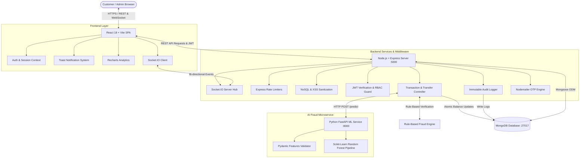

# 🏦 Finova — Smart Banking. Smarter Future.

[](https://nodejs.org/)
[](https://reactjs.org/)
[](https://fastapi.tiangolo.com/)
[](https://scikit-learn.org/)
[](https://www.mongodb.com/)
[](LICENSE)

---

## 1. Project Title
**Finova** — Smart Banking. Smarter Future. Next-Generation MERN & Python Microservices Digital Banking Platform with Machine Learning Fraud Detection and Real-Time Event Architecture.

---

## 2. Project Description
**Finova** is an enterprise-grade, human-centric full-stack digital banking ecosystem engineered to simulate modern retail banking operations under bank-grade security standards. Built on a decoupled distributed architecture, Finova pairs a high-performance **React 18 + Vite** client with an asynchronous **Node.js / Express** transactional backend, a real-time **Socket.IO** notification hub, and an autonomous **Python FastAPI / Scikit-Learn** AI fraud prediction microservice.

Finova enforces defense-in-depth security principles: strict RBAC, automated dual-engine fraud detection, cryptographic OTP validation via Nodemailer, NoSQL injection defenses, comprehensive immutable audit logging, and responsive UI/UX tailored for desktop and mobile devices.

---

## 3. Features

### 🔐 Authentication & Session Security
- Dual-role authentication (**Customer** and **Administrator**) powered by salted **bcrypt** password hashing and **JWT** bearer tokens.
- Secure **HttpOnly**, `SameSite=Strict` cookie transport alongside authorization header fallbacks.
- Granular password reset workflows using cryptographically signed SHA-256 tokens with strict 1-hour expiration.
- Account status lifecycle enforcement (Active, Frozen, Inactive) with immediate session revocation upon deactivation.

### 💳 Accounts & Balance Management
- Automated 12-digit account generation with standard checksum algorithms.
- Multi-account support per customer: **Savings** and **Current/Checking** accounts with customizable transfer limits.
- Real-time balance calculations, atomic ledger updates, and dynamic currency representation.
- Account freezing, reactivation, and soft deletion controls for customers and compliance officers.

### 💸 High-Throughput Financial Transactions
- **Deposits & Withdrawals**: Instant credit and debit workflows with balance validation, velocity checks, and institutional compliance thresholds.
- **Peer-to-Peer Fund Transfers**: Atomic account-to-account transfers with optimistic locking, same-account prevention, and daily limits.
- **Transaction History**: Filterable, paginated transaction explorer with search, date ranges, type tags, and printable transaction receipts.

### 👥 Beneficiary Management
- Frequent counterparty address book with nickname aliasing and bank identifier verification.
- Seamless one-click transfer invocation directly from beneficiary cards.

### 💳 Virtual Debit Cards
- Instant card provisioning (Visa Platinum Debit & Mastercard World).
- 16-digit card number masking, CVV generation, expiry scheduling, and bcrypt-hashed 4-digit PIN setup.
- Real-time card status toggles (Active, Frozen, Cancelled) and daily transaction limits.

### 📑 Loan Processing Center
- Customer self-service loan application portal (Personal, Education, Vehicle, Home, Business).
- Amortization calculation: tenor selection, interest computation, monthly EMI scheduling.
- Real-time loan lifecycle management: Pending Review, Underwriting Approval, and Rejection reasons.

### 🔔 Real-Time Notification Center
- Powered by **Socket.IO** for instant, low-latency client alert streaming.
- Contextual event triggers: `LOGIN`, `DEPOSIT`, `WITHDRAWAL`, `TRANSFER`, `LOAN`, `FRAUD`, and `ACCOUNT`.
- Unread counter badges, interactive slide-down menu, and dedicated notification archive with batch mark-as-read.

### 🛡️ One-Time Password (OTP) Security
- Reusable cryptographic 6-digit OTP engine for high-risk operations:
  - High-value transfers ($1,000+ or high risk scores)
  - Account security changes (PIN update, Password reset)
  - Secondary login verification
- Nodemailer SMTP dispatch with development console fallback.
- Security constraints: 5-minute strict TTL, 60-second resend cooldown, and 3-attempt brute-force lockout.

### 🚨 Hybrid Fraud Detection System
- **Dual-Engine Architecture**:
  1. **Rule-Based Engine**: Real-time evaluation of velocity, rapid bursts, night-hour transactions, new beneficiaries, and deviation from historical average spending.
  2. **Machine Learning Service**: Python FastAPI microservice utilizing a Scikit-Learn Random Forest model trained on synthetic banking patterns.
- Automatic graceful fallback: If the ML service is unreachable, transactions seamlessly route through the rule engine without interruption.
- Real-time Admin Fraud Alerts via Socket.IO for transactions flagged with `riskScore >= 70` (HIGH risk).

### 📊 Admin Control Center & Analytics
- Complete institutional telemetry: total deposits, withdrawals, transfers, loan liabilities, and customer metrics.
- Interactive **Recharts** visualizations: Cash flow distributions, customer onboarding velocity, and loan performance.
- Customer management: Search, filter, inspect accounts, and activate/deactivate access.
- Account & Loan controls: Freeze suspicious accounts and approve/reject loan requests with decision remarks.
- Centralized Fraud Alert triage table with one-click resolution and action tracking.

### 📜 Immutable Audit Logging
- Regulatory-compliant audit trail recording actor identity, action type, target entity, entity ID, client IP address, User-Agent, metadata, and timestamps.
- Zero-leak policy: Passwords, OTP codes, and payment card PINs are strictly excluded from audit payloads.
- Filterable admin audit log viewer with date-range picker, actor search, and JSON metadata inspector.

---

## 4. Screenshots Section

| Screen | Description | UI Highlights |
| :--- | :--- | :--- |
| **Customer Dashboard** | Primary financial overview | 4 Metric cards (Balance, Income, Expenses, Loans), Recharts Cashflow AreaChart, 6 Quick Actions, Recent Transactions |
| **P2P Transfer & OTP Modal** | High-value transfer workflow | Beneficiary autocomplete, instant risk calculation, auto-triggered OTP modal with countdown timer |
| **Virtual Cards Hub** | Debit card management | Realistic metallic card rendering, sensitive number toggles, freeze/unfreeze controls, limit configurations |
| **Loan Application & Status** | Customer borrowing portal | Interactive EMI calculator, purpose selector, real-time application status tracker |
| **Admin Analytics Console** | Institutional oversight | Recharts transaction volume, loan ratios, live system metrics, quick triage shortcuts |
| **Admin Fraud Monitor** | Compliance and security hub | Live Socket.IO alerts, risk score gauges (0-100), factor inspection, review/dismiss actions |
| **Audit Log Explorer** | Compliance log viewer | Filter by entity (User, Account, Transaction, Loan), action search, IP and metadata inspection |

---

## 5. Technology Stack

### Frontend (Client)
- **Framework**: React 18 (SPA)
- **Build Tool**: Vite 6
- **Routing**: React Router v6
- **Styling**: Tailwind CSS, PostCSS, Autoprefixer
- **Charts & Data Viz**: Recharts (Responsive Area, Bar, and Line charts)
- **Icons**: Lucide React
- **HTTP Client**: Axios (with centralized request/response interceptors)
- **Real-Time Client**: Socket.IO Client

### Backend (Server)
- **Runtime**: Node.js (v18+ LTS / v20+ / v24+)
- **Framework**: Express.js
- **Database ODM**: Mongoose 8 (MongoDB)
- **Security & Hardening**: Helmet (CSP, HSTS, NoSniff), CORS, Express Rate Limit, Cookie Parser
- **Validation & Sanitization**: Express-Validator, Custom NoSQL & XSS Sanitization Middleware
- **Cryptography**: Bcrypt.js (10 rounds salt), JSON Web Token (`jsonwebtoken`), Node Crypto
- **Email & Alerts**: Nodemailer, Socket.IO
- **HTTP Logging**: Morgan

### Machine Learning (Fraud Detection Microservice)
- **Language**: Python 3.10+
- **API Framework**: FastAPI & Uvicorn (ASGI)
- **Model Pipeline**: Scikit-Learn (`RandomForestClassifier`), Joblib
- **Data Engineering**: Pandas, NumPy
- **Validation**: Pydantic v2

---

## 6. Architecture



---

## 7. Folder Structure

```
banking-system/
├── frontend/                         # React + Vite Frontend Application
│   ├── public/                       # Static branding & favicon assets
│   ├── src/
│   │   ├── assets/                   # Theme images & CSS
│   │   ├── components/               # Component Design System
│   │   │   ├── ui/                   # Button, Input, Card, Modal, Table, Loader, EmptyState, etc.
│   │   │   ├── Navbar.jsx            # Responsive navigation & notification bell
│   │   │   ├── Sidebar.jsx           # Role-aware sidebar links
│   │   │   ├── Layout.jsx            # Application master layout
│   │   │   ├── ProtectedRoute.jsx   # Customer route guard
│   │   │   └── AdminRoute.jsx        # Administrator route guard
│   │   ├── context/
│   │   │   ├── AuthContext.jsx       # Global authentication state
│   │   │   └── ToastContext.jsx      # Global toast notification queue
│   │   ├── pages/
│   │   │   ├── auth/                 # Login, Register, ForgotPassword, ResetPassword
│   │   │   ├── customer/             # Dashboard, Accounts, Transactions, Transfer, Cards, Loans, etc.
│   │   │   └── admin/                # Admin Dashboard, Customers, Accounts, Loans, FraudAlerts, AuditLogs
│   │   ├── services/                 # Axios client, auth, transaction, and notification API connectors
│   │   ├── App.jsx                   # Master client routing table
│   │   ├── main.jsx                  # React DOM mount point
│   │   └── index.css                 # Tailwind typography and theme styles
│   ├── package.json
│   ├── tailwind.config.js
│   └── vite.config.js
│
├── backend/                          # Node.js + Express Backend API
│   ├── config/
│   │   └── db.js                     # MongoDB connection bootstrap
│   ├── controllers/                  # API business logic handlers
│   │   ├── authController.js         # Authentication, registration & profile
│   │   ├── accountController.js      # Account management & status updates
│   │   ├── transactionController.js  # Deposit, withdraw, transfer, & fraud checks
│   │   ├── cardController.js         # Debit card issuance & management
│   │   ├── loanController.js         # Loan applications & review
│   │   ├── notificationController.js # Notification queries & mark-as-read
│   │   ├── otpController.js          # OTP requests, verification & resend
│   │   ├── adminController.js        # Analytics telemetry & administrative operations
│   │   ├── fraudController.js        # Fraud alert reviews & resolution
│   │   └── auditLogController.js     # Regulatory audit log search & pagination
│   ├── middleware/                   # Security, auth, sanitization, & error interceptors
│   │   ├── authMiddleware.js         # JWT validation & role authorization
│   │   ├── errorMiddleware.js        # Centralized HTTP error handler
│   │   ├── rateLimitMiddleware.js    # Global, Auth, OTP, and Transfer rate limiters
│   │   ├── sanitizationMiddleware.js # Recursive NoSQL & XSS stripper
│   │   └── validateMiddleware.js    # Express-validator result collector
│   ├── models/                       # Mongoose schemas & database models
│   │   ├── User.js                   # Users, credentials, roles, & addresses
│   │   ├── Account.js                # Bank accounts & daily limits
│   │   ├── Transaction.js            # Ledger records & transaction references
│   │   ├── Beneficiary.js            # Transfer beneficiaries
│   │   ├── Card.js                   # Payment cards & encrypted PINs
│   │   ├── Loan.js                   # Loan contracts & underwriting terms
│   │   ├── Notification.js           # Real-time user notifications
│   │   ├── Otp.js                    # Cryptographic OTP records with TTL index
│   │   ├── FraudAlert.js             # Fraud alert cases & resolutions
│   │   └── AuditLog.js               # Immutable compliance audit entries
│   ├── routes/                       # Express router endpoint definitions
│   ├── scripts/
│   │   └── seedAdmin.js              # Idempotent administrator seeding tool
│   ├── services/
│   │   ├── fraudDetectionService.js  # Hybrid rule + ML evaluation engine
│   │   └── otpService.js             # OTP lifecycle & email dispatcher
│   ├── utils/                        # Helpers: JWT, Nodemailer, Audit Logger, Socket.IO
│   ├── package.json
│   └── server.js                     # Application entry point & HTTP/Socket server
│
├── ml-service/                       # Python AI Fraud Prediction Microservice
│   ├── main.py                       # FastAPI application & /predict endpoint
│   ├── train_model.py                # Synthetic dataset generator & model trainer
│   ├── model.joblib                  # Serialized Scikit-Learn Random Forest pipeline
│   ├── synthetic_transactions.csv    # Benchmark dataset
│   └── requirements.txt              # Python package dependencies
│
├── .env.example                      # Root environment configuration reference
├── .gitignore                        # Global Git exclusion rules
└── README.md                         # Comprehensive documentation
```

---

## 8. Installation

### Prerequisites
Ensure the following are installed on your machine:
- **Node.js** (v18.0.0 or higher) & **npm** (v9+)
- **Python** (v3.10 or higher) & **pip**
- **MongoDB** (v6.0+ running locally or MongoDB Atlas connection URI)
- **Git**

### Clone Repository
```bash
git clone https://github.com/your-org/banking-system.git
cd banking-system
```

---

## 9. Environment Variables

Finova provides clear environment templates. Copy the sample files:

### Backend Configuration (`backend/.env`)
```bash
cd backend
cp .env.example .env
```
Fill in the configuration variables:
```env
PORT=5000
NODE_ENV=development
MONGO_URI=mongodb://localhost:27017/finova
JWT_SECRET=super_secure_jwt_secret_key_at_least_32_chars_long_12345
JWT_EXPIRES_IN=1d
CLIENT_URL=http://localhost:5173

# Optional: Nodemailer SMTP Configuration
SMTP_HOST=smtp.mailtrap.io
SMTP_PORT=2525
SMTP_USER=your_smtp_username
SMTP_PASS=your_smtp_password
SMTP_FROM="Finova Security <security@finova.com>"

# AI Fraud Detection Service
ML_SERVICE_URL=http://127.0.0.1:8000
```

### Frontend Configuration (`frontend/.env`)
```bash
cd ../frontend
cp .env.example .env
```
Ensure the API endpoint points to your backend:
```env
VITE_API_URL=http://localhost:5000/api
```

---

## 10. MongoDB Setup

### Option A: Local MongoDB
1. Start your local MongoDB daemon:
   ```bash
   mongod --dbpath /path/to/data/db
   ```
2. Verify the server connects to `mongodb://localhost:27017/finova`.

### Option B: MongoDB Atlas (Cloud)
1. Create a free cluster on [MongoDB Atlas](https://www.mongodb.com/cloud/atlas).
2. Create a database user with read/write privileges.
3. Whitelist your current IP address (or `0.0.0.0/0` for development).
4. Update `MONGO_URI` in `backend/.env`:
   ```env
   MONGO_URI=mongodb+srv://<username>:<password>@cluster0.mongodb.net/finova?retryWrites=true&w=majority
   ```

---

## 11. Frontend Setup

```bash
cd frontend

# 1. Install dependencies
npm install

# 2. Start development server
npm run dev

# 3. Compile optimized production build
npm run build
```
The client will be accessible at `http://localhost:5173`.

---

## 12. Backend Setup

```bash
cd backend

# 1. Install dependencies
npm install

# 2. Seed Default Administrator & Customer
npm run seed:admin

# 3. Start development server with auto-reload
npm run dev

# OR start in production mode
npm start
```
The API server will listen on `http://localhost:5000`.

---

## 13. ML Setup (AI Fraud Microservice)

```bash
cd ml-service

# 1. Create and activate Python virtual environment
python -m venv venv
# On Windows:
.\venv\Scripts\activate
# On Linux/macOS:
source venv/bin/activate

# 2. Install required Python packages
pip install -r requirements.txt

# 3. (Optional) Re-train the Random Forest model on synthetic data
python train_model.py

# 4. Start the FastAPI microservice
uvicorn main:app --host 127.0.0.1 --port 8000 --reload
```
The ML service will be online at `http://127.0.0.1:8000`. Swagger API docs are accessible at `http://127.0.0.1:8000/docs`.

---

## 14. API Documentation

All routes require standard JSON payloads (`Content-Type: application/json`). Private endpoints require a Bearer token in the `Authorization: Bearer <token>` header or an authenticated HttpOnly cookie.

### Authentication Endpoints (`/api/auth`)
| Method | Endpoint | Access | Description |
| :--- | :--- | :--- | :--- |
| `POST` | `/api/auth/register` | Public | Register Customer or Admin account |
| `POST` | `/api/auth/login` | Public | Authenticate user & issue JWT |
| `GET` | `/api/auth/me` | Private | Retrieve authenticated user profile |
| `PUT` | `/api/auth/profile` | Private | Update profile details and phone number |
| `POST` | `/api/auth/forgot-password` | Public | Dispatch password reset token |
| `PUT` | `/api/auth/reset-password/:token` | Public | Reset password using valid token |
| `POST` | `/api/auth/logout` | Private | Invalidate session & clear cookies |

### Bank Accounts (`/api/accounts`)
| Method | Endpoint | Access | Description |
| :--- | :--- | :--- | :--- |
| `GET` | `/api/accounts` | Private | List all bank accounts belonging to user |
| `POST` | `/api/accounts` | Private | Open a new Savings or Current account |
| `GET` | `/api/accounts/:id` | Private | Get account details & live balance |
| `PUT` | `/api/accounts/:id/status` | Private | Update account status (Active, Frozen, Closed) |

### Transactions (`/api/transactions`)
| Method | Endpoint | Access | Description |
| :--- | :--- | :--- | :--- |
| `POST` | `/api/transactions/deposit` | Private | Deposit funds into specified account |
| `POST` | `/api/transactions/withdraw` | Private | Withdraw funds from account |
| `POST` | `/api/transactions/transfer` | Private | Execute P2P transfer (evaluates fraud risk) |
| `GET` | `/api/transactions` | Private | Paginated history of transactions |
| `GET` | `/api/transactions/:id` | Private | Get single transaction detail receipt |
| `GET` | `/api/transactions/account` | Private | Get primary account and live balance |

### Beneficiaries (`/api/beneficiaries`)
| Method | Endpoint | Access | Description |
| :--- | :--- | :--- | :--- |
| `GET` | `/api/beneficiaries` | Private | List saved transfer beneficiaries |
| `POST` | `/api/beneficiaries` | Private | Add a verified beneficiary account |
| `DELETE` | `/api/beneficiaries/:id` | Private | Remove a beneficiary |

### Virtual Cards (`/api/cards`)
| Method | Endpoint | Access | Description |
| :--- | :--- | :--- | :--- |
| `GET` | `/api/cards` | Private | List all virtual debit cards |
| `POST` | `/api/cards/apply` | Private | Provision a new debit card linked to account |
| `PUT` | `/api/cards/:id/status` | Private | Toggle card freeze / active state |
| `PUT` | `/api/cards/:id/pin` | Private | Change 4-digit card PIN (requires current PIN) |

### Loans (`/api/loans`)
| Method | Endpoint | Access | Description |
| :--- | :--- | :--- | :--- |
| `GET` | `/api/loans` | Private | List user's submitted loan applications |
| `POST` | `/api/loans` | Private | Apply for a loan with amount, tenure & purpose |
| `GET` | `/api/loans/:id` | Private | View loan details and repayment terms |

### Security & OTP (`/api/otp`)
| Method | Endpoint | Access | Description |
| :--- | :--- | :--- | :--- |
| `POST` | `/api/otp/request` | Public / Private | Request a cryptographically secure 6-digit OTP |
| `POST` | `/api/otp/verify` | Public / Private | Validate submitted OTP against hash & attempts |
| `POST` | `/api/otp/resend` | Public / Private | Resend OTP respecting 60s cooldown |

### Notifications (`/api/notifications`)
| Method | Endpoint | Access | Description |
| :--- | :--- | :--- | :--- |
| `GET` | `/api/notifications` | Private | Fetch unread and historical notifications |
| `PUT` | `/api/notifications/:id/read` | Private | Mark specific notification as read |
| `PUT` | `/api/notifications/read-all` | Private | Batch mark all notifications as read |

### Administrative Endpoints (`/api/admin`)
*Strictly restricted to users with `role: 'admin'`.*
| Method | Endpoint | Access | Description |
| :--- | :--- | :--- | :--- |
| `GET` | `/api/admin/dashboard` | Admin | Complete institutional telemetry and chart stats |
| `GET` | `/api/admin/customers` | Admin | Customer directory with search and status filters |
| `PUT` | `/api/admin/customers/:id/status` | Admin | Activate or deactivate customer user account |
| `GET` | `/api/admin/accounts` | Admin | Institutional account registry |
| `PUT` | `/api/admin/accounts/:id/status` | Admin | Freeze, activate, or close any customer account |
| `GET` | `/api/admin/loans` | Admin | List all submitted customer loan applications |
| `PUT` | `/api/admin/loans/:id/approve` | Admin | Approve loan and record underwriting remarks |
| `PUT` | `/api/admin/loans/:id/reject` | Admin | Reject loan with formal reason |
| `GET` | `/api/admin/fraud-alerts` | Admin | List triggered fraud alert cases |
| `PUT` | `/api/admin/fraud-alerts/:id/resolve`| Admin | Resolve alert (`APPROVED`, `REJECTED`, `DISMISSED`) |
| `GET` | `/api/admin/audit-logs` | Admin | Searchable, paginated regulatory compliance logs |

### Python ML Microservice (`http://127.0.0.1:8000`)
| Method | Endpoint | Access | Description |
| :--- | :--- | :--- | :--- |
| `GET` | `/` | Public | Service health & model status |
| `POST` | `/predict` | Public | Predict fraud probability (returns score & risk level) |

---

## 15. Testing

Finova features an automated End-to-End and Edge-Case Test Suite covering all 15 core functional modules and 11 critical banking edge cases.

### Run Automated Test Suite
Ensure the backend server and ML microservice are running, then execute:
```bash
node "scratch/test_phase19_e2e_edgecases.js"
```

### Verified Test Cases (100% Pass Rate):
- **Core Flows (15)**:
  1. Customer Registration & Token Issuance
  2. Receiver Customer Registration
  3. Admin Registration
  4. Customer Authentication & Credential Validation
  5. Profile Query & Update
  6. Account Retrieval & Secondary Current Account Creation
  7. Deposit Processing
  8. Cash Withdrawal Processing
  9. Peer-to-Peer Transfer Execution
  10. Transaction Ledger Inquiries & Detail Receipts
  11. Beneficiary Creation & Listing
  12. Virtual Debit Card Provisioning & Listing
  13. Loan Application & Submission
  14. Admin Telemetry & Loan Underwriting Approval
  15. Notifications Query & Batch Mark-as-Read
  16. Security OTP Dispatch
  17. Dual-Engine Fraud Interception on High Outflows
- **Edge Cases (11)**:
  1. Negative Deposit, Withdrawal, and Transfer Rejection (400)
  2. Zero-Amount Transaction Rejection (400)
  3. Insufficient Available Balance Rejection (400)
  4. Non-Existent Receiver Account Rejection (404)
  5. Same Sender and Receiver Transfer Rejection (400)
  6. Inactive / Frozen Account Outflow Block (400/403)
  7. Corrupted / Malformed JWT Rejection (401)
  8. Unauthorized Customer Access to Admin Endpoints (403)
  9. Expired or Invalid OTP Code Rejection (400)
  10. Excessive OTP Guessing Attempt Lockout (400)
  11. Daily Account Transfer Limit Exceeded Rejection (400)

---

## 16. Security Architecture

- **Defense-in-Depth Headers**: **Helmet** configures Content-Security-Policy (CSP), Strict-Transport-Security (HSTS 1-year preload), X-Content-Type-Options (`nosniff`), and origin-isolated Referrer policies.
- **Granular Rate Limiting**:
  - `globalLimiter`: 500 requests per 15 minutes per IP.
  - `authLimiter`: 15 authentication attempts per 15 minutes to block credential brute-forcing.
  - `otpLimiter`: 50 OTP requests per 15 minutes to prevent SMS/email bombing.
  - `transferLimiter`: 30 transactions per 15 minutes to restrict automated balance draining.
- **Input Sanitization**: Custom recursive middleware purges MongoDB query operators (`$gt`, `$ne`, `$regex`) and strips cross-site scripting (`<script>`) tags from all requests.
- **Payload Boundaries**: Request bodies strictly capped at `50kb` to protect memory allocations against payload bloat.
- **Password Security**: Bcrypt with adaptive work factor (10 salt rounds); password hashes never returned in API queries (`select: false`).
- **Audit Logging**: Sensitive tokens, OTP codes, and plain PINs are filtered from immutable audit logs.

---

## 17. Fraud Detection Engine

Finova uses a hybrid dual-engine approach combining deterministic rule heuristics with predictive machine learning:

### 1. Rule-Based Engine
Evaluates dynamic heuristics:
- **High Outflow Threshold**: Transfers $\ge \$1,000$ trigger mandatory verification.
- **Velocity Ratio**: Transfers exceeding $3\times$ customer historical average spending.
- **Rapid Transfers**: Multiple consecutive transfers executed within 10 minutes.
- **New Beneficiary**: First-time transfer to a beneficiary added in the last 24 hours.
- **High-Risk Hours**: Transactions initiated during abnormal overnight windows (01:00 - 05:00).
- **Recent Failures**: Accounts with recent failed auth/OTP attempts.

### 2. Machine Learning Model (FastAPI Microservice)
- **Model**: Scikit-Learn `RandomForestClassifier` trained on 10,000+ synthetic transactions.
- **Features Analyzed**:
  - `amount`, `transaction_frequency`, `account_age`, `transaction_hour`
  - `previous_average_amount`, `failed_attempts`, `location_change`, `is_new_beneficiary`
- **Output**: Generates a continuous `fraud_probability` ($0.0 - 1.0$), mapped to integer `riskScore` ($0 - 100$) and categorical `riskLevel` (`LOW`, `MEDIUM`, `HIGH`).

### 3. Graceful Fallback
The Node.js backend features resilience circuitry: if the Python ML microservice is unreachable or errors, transactions immediately fall back to the internal rule engine. High-risk transactions trigger OTP challenges and notify administrators in real-time via Socket.IO.

---

## 18. Future Scope

1. **Native Mobile App**: Cross-platform client using React Native / Expo sharing existing REST & Socket.IO APIs.
2. **Multi-Currency & FX**: Real-time currency conversions with automated foreign exchange rates.
3. **Biometric WebAuthn**: Fingerprint and FaceID authentication using FIDO2 standards.
4. **Card Management Integrations**: Integration with physical card fulfillment networks and Apple Pay / Google Wallet provisioning APIs.
5. **Open Banking & Plaid**: API aggregation for external account linking and balance transfers.
6. **Distributed Ledger**: Secondary immutable ledger backing critical transfer records with blockchain or Amazon QLDB.

---

## 19. Production Deployment Guide

### A. Deploy Frontend (Vercel / Netlify / Cloudflare Pages)
1. Set build command: `npm run build`.
2. Set output directory: `dist`.
3. Set environment variable: `VITE_API_URL=https://your-api-domain.com/api`.

### B. Deploy Backend (Render / AWS ECS / DigitalOcean)
1. Install dependencies: `npm install --omit=dev`.
2. Seed initial admin: `npm run seed:admin`.
3. Start command: `node server.js` or `pm2 start server.js --name "finova-api"`.
4. Configure production environment variables in the provider dashboard (`MONGO_URI`, `JWT_SECRET`, `CLIENT_URL`, etc.).

### C. Deploy Python ML Service (Render / Fly.io / AWS EC2)
1. Run with production ASGI server:
   ```bash
   uvicorn main:app --host 0.0.0.0 --port 8000 --workers 2
   ```

---

## 20. Default Quick-Demo Credentials
For quick local verification, initialize the database using the seed script:
```bash
cd server
npm run seed:admin
```
You can log in directly at [http://localhost:5173/login](http://localhost:5173/login) using either the **1-Click Demo Buttons** or manual entry:

- **Admin Portal**:
  - **Email**: `admin@securebank.com`
  - **Password**: `admin123` (or click the **Admin Demo** button)
  - **Features**: Live metrics, Loan approvals, Account freezing, Fraud triage, Audit logs

- **Customer Portal**:
  - **Email**: `customer@securebank.com`
  - **Password**: `password123` (or click the **Customer Demo** button)
  - **Features**: Funded account ($5,420.50), P2P Transfers, Virtual Cards, Loans, Analytics

---

## License
Distributed under the MIT License. See `LICENSE` for more information.
# FinovaBank
